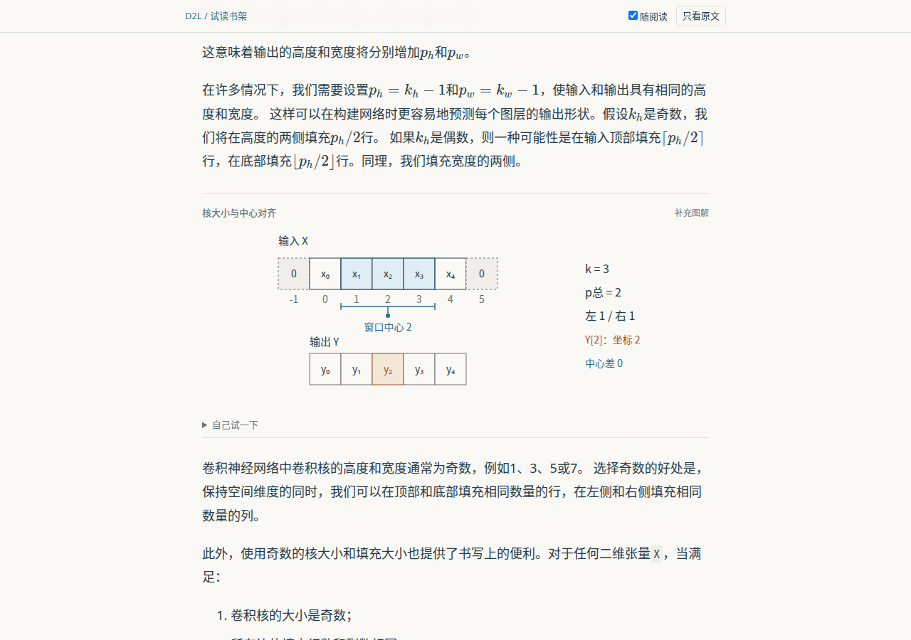

# D2L 可视化教材实验：现在能做到哪一步

这条路值得继续做。现在已经能让 LLM 在多个章节里选出一些有用的关系，生成放在正文里的图，再用局部修改改善它们。最有价值的不是让整页动起来，而是让读者改一个量，就看清原来只在公式里出现的关系。

但“稳定批量生产优秀教材”还没有做到。六个章节能运行，和一本书值得读，是两件事。本轮没有用户试读，也没有测学习收益。图的选择和解释仍需审查，数学检查还按具体例子编写。这个判断不能被下面那些通过数量冲淡。

本轮开始于北京时间2026-10-10 20:07:40。完整过程、最终用时、发布与CI状态记录在[日志](LOG.md)；生成、导入和检查失败均保留。没有并行额外代理；经用户明确允许，串行调用官方已登录Codex CLI八次。

## 先打开什么看

从本机的[试读书架](http://127.0.0.1:8768/index.html)进入，或按[重建说明](../../../experiments/visualbook/README.md)重建。HTML、公式字体、公式、图片和图解都在本地文件中，正文字体使用设备系统字体，离线可以读；原版来源链接仍需要网络。

可以先看“填充和步幅”：把步幅设为2，右侧填充从0调成1，最后一个窗口刚好能放下，输出从2格变为3格；再加一格，输出不增加。这个变化能解释公式为什么要向下取整。再看“梯度下降”：学习率逐渐变大时，下降收益与曲率代价怎样相互抵消。

这是实际浏览器截图，属于维护会话采样，不是用户接受记录。

这不是让你按播放键等动画。你照常滚动阅读；图在短范围内改变强调的关系。“自己试一下”默认收起来，打开后可以改参数、停在一个状态，之后回到阅读位置。没有鼠标追踪。短屏使用普通文中图，不让固定图占掉大半屏幕。

## 六个章节实际产出了什么

| 章节 | 新图解释的关系 | 最终版本 |
|---|---|---|
| 汇聚层 | 小幅移动只可能保持某个局部输出；不同窗口、填充和步幅怎样选到输入 | 原始生成 |
| 随机梯度下降 | 单个样本梯度与同一组样本的平均梯度；重复抽样与洗牌为何覆盖不同 | 模型局部修订 |
| 注意力评分函数 | 掩蔽怎样按行影响softmax；点积缩放怎样改变分布宽度 | 维护会话补概率轴 |
| 多GPU训练 | 先求和再广播的当前阶段；固定全批量时为何所有副本仍得到相同更新 | 模型局部修订 |
| 梯度下降 | 一步更新的下降收益与曲率代价；按各坐标曲率调整更新 | 原始生成 |
| 填充和步幅 | 奇偶核的中心对齐；合法窗口起点与输出尺寸的取整 | 维护会话修手机标签 |

共12幅当前图。每幅都有输入与来源、生成源码、数值复算、实际渲染和采样图、审查或修订记录。完整正文、原图、PyTorch代码继续保留；图不是教材的替代品。示意参数是手选例子，不是训练得到的权重，也不是实测GPU性能。

不是挑着成功章节报告。首批从四组预登记的合适章节里各随机选一节；后两节从预留章节中再随机选出两组。种子和源哈希在[首批清单](../../../experiments/visualbook/sampling.json)与[后两节清单](../../../experiments/visualbook/holdout-sampling.json)。这是分组随机，不是对整本D2L均匀随机；候选池仍由维护者选择，外推范围有限。

后两节使用了改进的要求和原图截图，前四节初稿只收到原图描述。因此这不是严格的前后对照，不能据此算出提示改进带来了多少成功率提升。

## 这次主动改善了什么

**先让生成器知道原书已经有什么。** D2L的Markdown源码不含代码运行输出。如果只给它这份文字，它很容易重复书里已有的曲线，最后把“重新画了一遍原图”误当成增益。现在导入保留原图，并可从原版公开网页补回输出；只有代码能唯一对应时才补入。六节网页的35个代码单元中，20个能匹配，15个未匹配。不伪造缺失输出，也没在本机执行D2L训练代码。网页快照有日期和哈希，但构建提交未知，原版对照仍不完全。

**让图更安静，默认先读正文。** 去掉图内的大段说明，图中主要留下标签、坐标和数值。参数与审查假设收在图下方，正文和图在同一阅读流中。统一已知颜色、提高文字对比度；窄屏重新排列控件和图形，减少简单缩小桌面图造成的小字。这个风格是否好读，目前是维护会话的判断，还要等你试读。

**减少读到一半被顶走的情况。** 图预留各状态需要的高度，原SVG图片也预留固有尺寸。切换原文对照时保留附近段落的位置。无脚本和打印时显示完整的静态解释状态，单个互动图失败时仍有静态图和正文。

**让意见能落到具体版本。** “记下问题”会把图版本、当前状态、参数和你的文字存成本地JSON。导入修订时拒绝过期版本，并要求只改有问题的图。这里实际测试了导出、导入和拒绝旧版本；测试意见明确是工程输入，不是用户评价。它不会自动向外发送，也不会自动调用模型。

**给生成器留出不作图的选择。** 后续协议允许零到两幅图；没有新增价值就说明理由，保留原文。这个新规则只做了协议检查，尚未用真实生成评估。八次真实调用使用的旧要求和输出协议已单独保留，不能把新规则的效果追算给旧结果。

## 发现了哪些问题，又怎么处理

| 问题 | 为什么常规通过检查还不够 | 本次处理 |
|---|---|---|
| SGD梯度图横纵单位尺度不同，轴名像参数 | 返回的梯度数字都正确，画出的角度仍会误导 | 带具体截图和意见做模型修订；无关覆盖图源码字节不变 |
| 多GPU初始阶段已经写出最终求和结果 | 初始数字没错，但当前阶段和文字不一致 | 模型修订，只显示已发生的步骤，同时固定图高 |
| 手机窗口图两个标签碰撞 | 数值复算17/17，仍然挤在一起 | 保存失败截图；维护会话另存只删重复标签的版本 |
| 点积图概率轴没有可见刻度 | 分布方差正确，读者却不知道高度代表什么 | 维护会话补坐标，并核对实际竖线高度 |
| D2L一个多行公式把后半章吞进公式 | 图能渲染也掩盖不了正文导入丢失 | 修正分隔符适配，48块恢复为79块；遇到公式里含代码或标题就拒绝构建 |
| 手机原文长公式撑开整页 | 单行双美元公式被当成行内式，图内检查仍为零问题 | 只修显示方式，保留原始块和输入哈希，公式可在本地横向滚动 |
| 检查器不认识向量标签空格 | 把自己的解析问题算成图错，会错误拒绝候选 | 保留误报，修正检查器后重核同一源码 |
| 自动化点击固定按钮先滚动页面 | 产生了读者真实屏幕点击没有的跳动 | 按事件时序定位，改成屏幕坐标点击，保留失败结果 |

另有来源审查：模型指出梯度下降原文把误差平方上界称为“线性”、固定比例误差上界称为“恒定”。维护者独立核对[MIT数值模拟讲义第16、24页](https://ocw.mit.edu/courses/6-336j-introduction-to-numerical-simulation-sma-5211-fall-2003/176914834032f0c2438eb23cf185a65f_lec8a.pdf)：通常分别称二次、线性收敛。原文未静默改写。填充章节的总填充与每侧填充记号也在图的假设中明确区分。

这些失败说明，接下来不能只追求“生成成功”和“检查通过”。还得看图是否让人形成了正确直觉，以及它是否值得占据这一段的注意力。

## 证据具体到什么程度

八次正式独立调用包括六次初稿、两次带截图的局部修订，全部通过官方ChatGPT登录完成，未调用生成上下文的工具。合计模型等待1432.888秒，约23分53秒；原始用量字段输入246,823、输出51,475，缓存输入13,312。推理输出子字段17,581另列在[调用记录](calls/)，不再加到总输出上。本维护会话自身的用量不在这八次统计中。

两次额外的源码改动由当前维护会话完成，分别修手机重复标签和概率轴；它们不是第九、第十次独立生成。所有首版保留。当前版本选择在[active.json](../../../experiments/visualbook/active.json)，真实调用的输入版本在[input-versions.json](input-versions.json)。

独立数值复算当前为210/210个状态与参数组合；实际SVG关系检查228组合，其中18个是应该失败的旧版关系，均正确识别，没有意外。检查的是特定例子的式子、箭头、横条、等值线和概率竖线，不是通用教学判分。

实际浏览器使用四种视口：1280×900、600×800、375×812、360×640。最终图版本合计348个渲染组合，图标签越界/相互重叠/过小和页面横向溢出均未发现；每份记录对应的HTML与检查器哈希保留。具体数量见[验收摘要](SUMMARY.json)。来源块顺序与哈希保留、无脚本静态图可见；79项实际阅读控制检查通过，观察到外网请求0。它们是脚本操作，不是78位读者。

还在新的源码与依赖目录中重新克隆固定上游、安装锁文件、重建六节并运行数学/关系/阅读检查。它依然使用同一台主机的Node和Chromium，不能称为跨机器验证。CI不调用模型，只重建和核对冻结候选。旧仓库的58项Node、87项Python和三个基础案例检查一次通过。

依赖审计曾发现间接KaTeX旧版带来的4个low；通过声明式版本覆盖统一到0.18.7，重新安装后npm报告0。没有修改第三方源代码。已知颜色对比度检查也只覆盖这些不透明颜色组合，不是整页无障碍认证。[W3C的文字对比要求](https://www.w3.org/WAI/WCAG22/Understanding/contrast-minimum.html)用于参考，不作为整页认证结论。

## 旧项目怎么用，下一步怎么走

旧项目值得借的是：固定输入和版本、保存真实画面、把数学与表达分开、局部修改时保护其他部分、记录失败。旧评分器没有足够证据充当新教材的裁判，旧视频时间轴也不适合直接管阅读。本轮新增流程独立，旧负结果继续留着；现在不值得先把所有旧代码大重构一遍。

目前SVG是一个方便的后端，适合这些短图，不是这个项目的边界。后续某个图用HTML、Canvas或者Zanim更容易表达，就应该允许它。统一的部分应是正文位置、输入依据、修改记录和阅读控制，不能要求所有图用同一种绘图语法。

接下来优先做三件事：

1. 让你实际读几段，指出哪里更容易懂、哪里烦，再做小范围修改；不先给每幅图打一个假装客观的综合分。
2. 用新的随机章节继续换题材，尤其是不能轻易画成数组格子或二维曲线的内容。保留没有新增图价值的章节，看看生成器是否会乱凑图。
3. 减少每换一题都要手写很多检查的成本，先复用已经有明确意义的关系检查；不急着建立大代理平台或给整本书铺满控件。

当前最大的限制是：手机不固定图时，图可能早于后面的文字滚出屏幕；阅读位置只是粗略估计；默认示意参数不一定与最近的原文例子一致；只有一个后端和少量章节；审查仍由维护会话承担。以上都需要继续改，不能靠这次可运行来宣布解决。

完整可视化教材尚未作为正式作品发布。本仓库保存的是可复用实现、冻结候选和研究证据。教材全文、上游仓库、敏感原始日志和大量中间图留在忽略目录。发布审计的实际范围和局限见[发布记录](PUBLICATION.md)。
