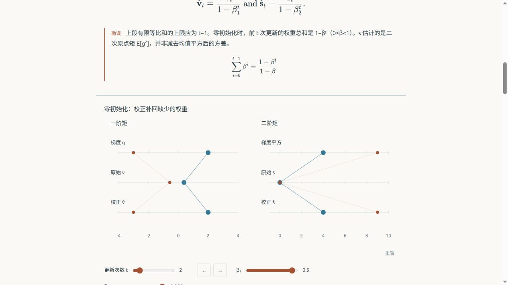

# 七小时工具层迭代报告

这轮的重点是把“每次都靠模型临场画图”变成“模型能调用、拼接和检查已有工具”。滚动驱动已经从默认交互中取消。共享工具目前有 **41 个绘图组件、61 个设计、31 个数值操作**。数量不是质量成绩：有些设计是同一组件的不同组合，也仍有六个旧设计直接使用绘图代码。

这比上一轮更接近工具工程，但还不能承诺“任意一本书输入，不要反馈，就能得到优秀教材”。真实整章生成仍有失败；模型也经常选择自己写图。下面保留这些区别，避免把维护者写出的漂亮示例当成模型的稳定能力。

开始时间为北京时间 2026-10-11 02:03:51；结束时间和发布状态见末尾的执行记录。原始版本是 `bb53a024c5b5effa6ec3bb0146091f53a280f27b`。这轮没有并行代理，真实生成使用已有登录的官方 Codex CLI，串行、固定预算，不提取凭据。

## 读图方式改了什么

图的变化不再由向下滚动决定。默认停在可读的状态，有三种合适的方式：

- 连续关系可以拖动滑块或图中的点。例如移动查询点，同时看到核权重、贡献和结果变化。
- 离散过程使用前一步、后一步。例如优化器第几次更新、程序执行第几步，不把整数步骤伪装成连续物理运动。
- 适合演示的图可以主动播放一次，随时暂停。滚轮、离开视野、切换页面或减少动态效果设置会暂停；同一时刻只播放一幅图。

图仍与相关正文在同一阅读路径上，没有把整章分成左右两块。禁用脚本时保留实际渲染的初始图和公式。GIF/MP4 是可选出口：已经实际导出一个 3 秒、20fps、60 帧的演示并完整解码，不默认循环播放，也不拿视频代替可操作的图。记录保留了两次首次绘制像素不一致的失败；预热是本地缓解措施，不是所有浏览器稳定性的保证。

## 工具确实增加了什么

这里的“积木”不只是给模型看的提示词。组件有实际坐标、布局、字体测量、状态更新和浏览器绘制；数值操作返回可检查的数据。模型可以把前一个操作的结果接给后一个操作，把同一份状态接给多幅视图，而不用重写整个算法和图。

| 领域 | 可以实际调用的部分 | 可以怎样拼起来 |
| --- | --- | --- |
| 数学 | 向量、矩阵、投影、导数、积分、等高线、解析梯度、采样色场 | 同一个二维点连接函数值、梯度箭头、等高线和两层响应 |
| 机器学习 | 稳定 softmax、交叉熵及梯度、一步参数更新、核加权查询、多项式 QR 拟合、优化器状态 | 分数 → 概率 → 损失梯度 → 更新后分数 → 新概率；权重 → 贡献 → 加权结果 |
| 深度学习 | 张量、归约轴、标准化、线性层/ReLU/反向传播、注意力、卷积依赖、感受野、多维索引 | 输入 → 投影 → 注意力权重 → 输出；同一个元素在拆头、转轴、合并后保持身份 |
| 编程 | 行优先索引、步长、广播、有限缓存生命周期、任务依赖、共享缓冲区 | 同一索引连接位置、偏移和可见值；同一执行步骤连接任务与状态 |

组合可以使用共享参数、共享选中元素、之前计算的结果和嵌套布局。有限大小、已知字段和形状在构建时验证；错误引用、非法维度和非有限数值会被拒绝。`put_design` 可以直接按名称、正文锚点和有限数据替换写入设计。目录检索返回是否可组合、控制数量、所需计算和数据入口，不只返回一段示例代码。

最新补的三个数值操作来自实际生成暴露的缺口：

1. `optimizer-trace` 保留 SGD、Momentum、AdaGrad、RMSprop、Adam、Yogi 每一步的输入、梯度、历史状态和更新。Adam 的零初始化与偏差校正真实计算，不用预设动画冒充训练。
2. `gradient-step` 接收明确梯度，返回实际一步更新。它可以接到交叉熵，也不会自动声称输入梯度正确或损失一定下降。
3. `tensor-reindex` 明确记录最多四轴的转置/重排及每个元素的新位置。它展示索引对应，不声称真实 GPU 的内存复制或零复制行为。

新 softmax 分类、Adam、优化器曲面和拆头设计是这些操作的可执行组合。另有同色身份图例、紧凑比较行、适合向量的矩形格子和可点选张量。没有靠把字体缩到难以阅读、把微小非零数显示为零来掩盖布局问题。

## 审美借鉴落在哪里

公开参考和许可证逐项记录在 [REFERENCES.md](REFERENCES.md)。参考包括 Red Blob 的直接操作、Mafs 的坐标关系、Distill 的图文节奏、Ciechanowski 的连续参数演示、TensorFlow Playground 的输入和输出联动等。这些是设计参考，没有把参考网站的整页、图片或训练效果复制进来冒充自己的结果。

共享设计采用较安静的纸色背景、少量语义颜色、稳定对象和短标签。颜色尽量表示“同一个对象”或“不同角色”，而不是每一行换一套装饰。文字解释放在正文，图内主要保留位置、数值和关系。相同概率和矩阵权重使用同一计算结果，避免两个看起来有关的图其实各自写了数据。

维护者实际查看了全部初期 43 幅模型图的手机中间态、19 幅后续对照图的手机中间态，以及部分桌面和上下文画面；详细范围在复核 JSON。后续生产和重放另记。检查者是维护者 AI，没有人类盲评或教师审查。

仍有不足：部分图的控件和留白偏多，正文中的可视化节奏依然依赖模型选择；不少自写图只是清楚的条形图，达不到那些优秀参考的设计完成度。统一配色能减少粗糙感，却不能自动让每章都有好叙事。零浏览器发现不代表好看，数值正确也不能证明图的语义和教学有效。

## 真实生成结果：分组看，不合并成“优秀率”

各组使用 `gpt-6.1-sol` / high，保留实际启动、原文、版本、修订和图片反馈。模型内部修订属于工具工作流；维护者没有事后改候选代码。不同阶段的工具版本和任务政策不同，不能把所有结果混在一起宣布方法收益。

| 组别 | 实际启动 | 最终工程导出条件通过 | 能说明什么 |
| --- | ---: | ---: | --- |
| 初期比较与迁移 | 16 | 14 | 有限同源比较、四章流水线和同头复核；并非全部使用同一工具版本 |
| 冻结后的新章对照 | 8 | 4 | calculus、欠拟合/过拟合、核回归、参数管理；失败仍保留 |
| 新生成政策四章生产 | 4 | 1 | Adam、softmax、多头注意力、自定义层；全书拒绝导出 |
| 补实际缺口后的定向重放 | 2 | 1 | 同一 Adam/softmax 原文，版本 cec6a00；不是未见章节或公平方法对照 |

初期四章完整流水线的概率、权重衰减、批标准化、数组章节通过流程条件，装订为四章、11 幅图的离线教材。不过四章完全使用自写图，原生组合采用为零，不能据此声称积木已经被模型充分使用。

同头复核也没有给出稳定成本收益：autograd 的工具臂比直接生成更慢，线性回归也更慢、累计上下文更多。少写代码不足以证明更快或更好。直接生成有时主动发现原文条件缺失，工具臂不保证发现同样问题。

八次新章对照有 19 幅图，仅采用两个命名设计；核回归和微积分的两臂都出现未解决问题。原计划记录取样池、随机种子和已知参考接触：其中核回归在抽样前已经被维护者阅读，不能称为完全未见。

四章生产的八幅图中，三幅是原生组合、五幅自写，命名设计采用为零。Adam 通过；softmax 被长原文公式的整页溢出阻止；多头注意力因手机张量数值格过密失败；自定义层的最后预览失败且没有匹配的最终问题记录。每场进程都退出成功，但整本教材没有完成。失败推动了共享公式、向量布局和新数值操作，而不是回去手修四份作品。

定向重放完成两次，工程条件仍为1/2：Adam使用命名adam-bias设计，并为稀疏梯度比较自写一图；softmax两图采用原生scene。原文和模型候选代码未被维护者改动。Softmax的拒绝来自“原图空白”，独立检查证明这是预览截图没有触发懒加载的误判：正常滚到原图时，336px宽图片解码成功且有10292个深色像素。新的preview先加载/解码原图并等待绘制，原HTML字节不变的复采零发现。原模型review与1/2分母仍保留，没有因为维护者复采就改成2/2自动成功。

这条发现比再手改一幅图更有用：它修的是模型的观察工具。以后模型不应再根据尚未载入的原图做错误修订或拒绝。另将Yogi状态和每维矩状态曲线补进统一计算，新增可组合稀疏梯度设计。它在本轮只由维护者构建/渲染，没有再追加模型调用验证采用率。

新默认政策要求模型先查找已有工具，自写图要记录缺口和代码哈希。这能留下可追查的需求，不能强迫模型给出真实的覆盖判断，也不是安全沙箱或教学质量判定。定向重放与此前开放绘图的方法不同，因此只用于检验新工具能否被实际使用。

## 数学、浏览器与作品质量分别检查

首 24 次候选的独立 Python 核对覆盖 1688 份实际浏览器事实、29324 项含嵌套数组的断言，没有数值失败。它们不是 29324 条独立定理，也没有覆盖全部连续参数。复核不导入共享计算内核，不运行模型自己写的验证代码。

生产四章另核对226份事实、4066项断言；其中自定义层的最后预览没有事实，明确使用更早完成的preview02，不验证失败的最终候选。定向重放另核对164份事实、2150项断言，均无数值失败。

新算法另外用独立库核对：PyTorch CPU float64 的 600 次优化器更新、96 个交叉熵/真实梯度/更新配置；NumPy 的 124 个转轴配置、1984 个元素映射；QR 拟合与 NumPy SVD / SciPy 另有 24 个配置。Yogi另有24个配置、744次独立CPU float64张量递推，最大状态差2.35e−11；不是torch.optim自带Yogi、原D2L训练或无偏证明。上述有限检查通过。它们不证明训练收敛、模型学到了权重或解释方式有效。

冻结 cec6a00 的 60 个维护者设计通过实际检查；最终共享内核冻结为 3ea10f6，61 个设计再次经过桌面/手机、有限进度、参数及注册控件检查，自动发现为零。两个版本的记录分别保留。此前目录中图例碰撞、科学计数放不下、手机高度不足和首次绘制不一致都没有删除。其后只澄清一幅设计的“完整预设序列/当前步”标签，内核不变；61设计另一次完整Chromium渲染也零发现，原冻结记录仍保留。整个目录仍是维护者示例，不能写成“61 本模型生成教材”。

Firefox 153.0 的最终检查使用 3ea10f6 的设计输出和五章已通过交付条件的混合版本教材：27 种维护者设计、564 个同源姿态/参数记录、有限注册控件操作、10 个禁用脚本的章节/尺寸检查，以及两尺寸真实播放、滚轮暂停和减少动态设置，零发现。旧 cec6a00 的 26 种设计、530 个记录也保留。不是全部 61 种设计的 Firefox 检查；没有实际手机硬件、触摸用户研究或完整跨浏览器保证。

整本原文在第一场作者前经过真实375/1280浏览器检查。固定22个D2L章节完成44个禁用脚本检查，零原文布局/公式覆盖/解码发现，零模型调用；这不是22章生成或新未见测试。首轮六次截图采集错误保留，后续技术预检不依赖截图。坏公式、坏图和最后一章的固定宽度溢出都有零模型正负控制。

工具会在原文导入、公式编译、最后预览身份、最终问题记录和实际操作等层面停止错误输出。失败构建不能拿旧 HTML 糊弄预览。局部公式阅读保留完整公式，不再让长公式撑开整页。源文中引出公式的冒号与后续公式之间不能随意插图，必要澄清另写，不默默修改原文。

## 目前真正的限制和下一步

最重要的限制仍是“选对解释”和“组织全章”。积木多了以后，模型仍可能查不到、选错或觉得自写更顺手。组合结构能复用计算和视觉身份，但并不能替代教材设计。下一步应继续用有数学审查基础的新章节，观察实际采用、失败原因和读者理解，不把目录数量当作终点。

现在只支持有来源的 Markdown 和导入 JSON；PDF/EPUB、任意网站解析、整书跨章概念一致性和自动检查所有原文数学并没有完成。参考中训练或采样过程如果被简化，必须说明。代码只面向本地授权生成，没有任意陌生代码托管服务。

还发现一个阅读细节：原生矩比较在线性轴上能忠实保留很小的非零值，但像素上接近零，缺少方便读者查看精确值的入口。没有为了显著而随意放大数值；后续可补统一的精确读数/提示。

最值得继续补的是可组合的跨图解释关系、对复杂张量与轴的阅读布局、图文插入位置和交互教学选择。每次扩工具前先保留实际失败，再用新章检查是否省掉临场绘图和用户反馈。这个仓库已经有更多可运行工具；稳定直出优秀整书的目标仍未达成。

## 可以直接打开的结果

本地入口是 http://127.0.0.1:8768/index.html ，已有 61 个设计的独立目录，以及五章、13 幅图的可读教材。五章来自不同阶段已经通过工程条件的真实模型输出，原 HTML 逐份按哈希核对，没有维护者再改代码：数组、概率、权重衰减、批标准化、Adam。它是便于审查的合集，不是同一最新版本一次生成的全书，也不是合理排课顺序的证明。

安装入口也补了一个实际问题：第一次GitHub CI的普通检查作业缺少KaTeX/unified，只有本机缓存能过。新setup_visualbook安装并核对固定依赖，独立新目录的19个Node文件/105项测试、91项Python测试通过；已有教材不被覆盖。它不代替浏览器安装或模型生成。

可以下载约 5.95MB 的离线 ZIP；仅包含教材、索引和许可证，设计目录另行浏览。相同五章/许可证在本地实际打包两次，固定归档时间/权限后ZIP字节一致；不同压缩库版本仍不保证完全相同。不要把整个大目录当作读书内容。参考实际阅读位置的截图：

## 最终执行与发布记录

原始 provider 事件、第三方源码、浏览器中间 HTML 与视频留在 ignored `work/`；公开证据保留输入、有限修订、浏览器事实与抽样 PNG。推送前审计拟发布文件、main 历史和可访问 GitHub 表面；不把内部 checkpoint refs 当成发布目标。实际结束时间、推送提交和审计范围在完成后追加。
